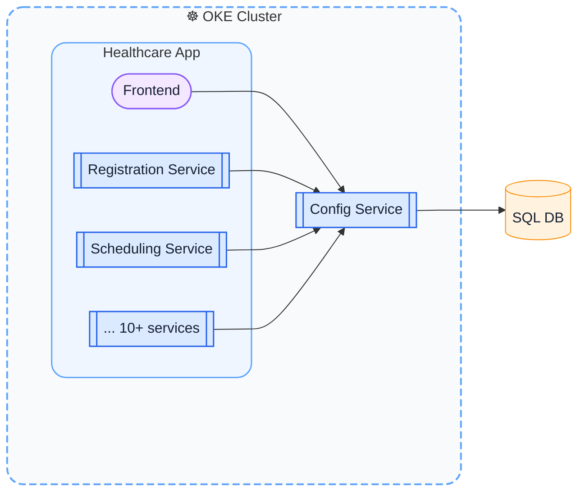

# Configuration Service

Centralized configuration platform for a large healthcare microservice ecosystem.

Java SQL / Liquibase Kubernetes

## What I built

A `(key, value, scope)` configuration service (APIs + client library) that replaced scattered Helm/env-based configs with a single, programmatic service.

-   supported feature flags + environment configs
-   enabled hierarchical overrides (global → region → tenant → org)
-   exposed a POST API for services to register their config definitions
-   exposed via a shared client library used across 10+ services

## Why it mattered

Configuration was becoming unmanageable:

-   duplicated across services + environments
-   hard to reason about overrides
-   tightly coupled to deployments

This system:

-   became the single source of truth for configs
-   enabled runtime safe, flexible overrides per tenant/org
-   hugely reduced probability for deployment issues by decoupling config from Helm

## How it worked

-   Micronaut service running in OKE
-   configs stored in SQL (Oracle Autonomous DB)
-   services fetch config at startup and cache locally
-   resolver selects the most specific scoped value

Example hierarchy:

ORG > TENANT > REGION > GLOBAL

## My impact

-   owned design + implementation end-to-end
-   wrote plan for phased migration of core microservices onto the platform
-   served as point person for carrying out the migration^
-   overall, saw improved reliability of services, both at deployment time and during runtime

⚡ Result: simpler config management, safer deployments, and scalable support for multi-tenant customization
