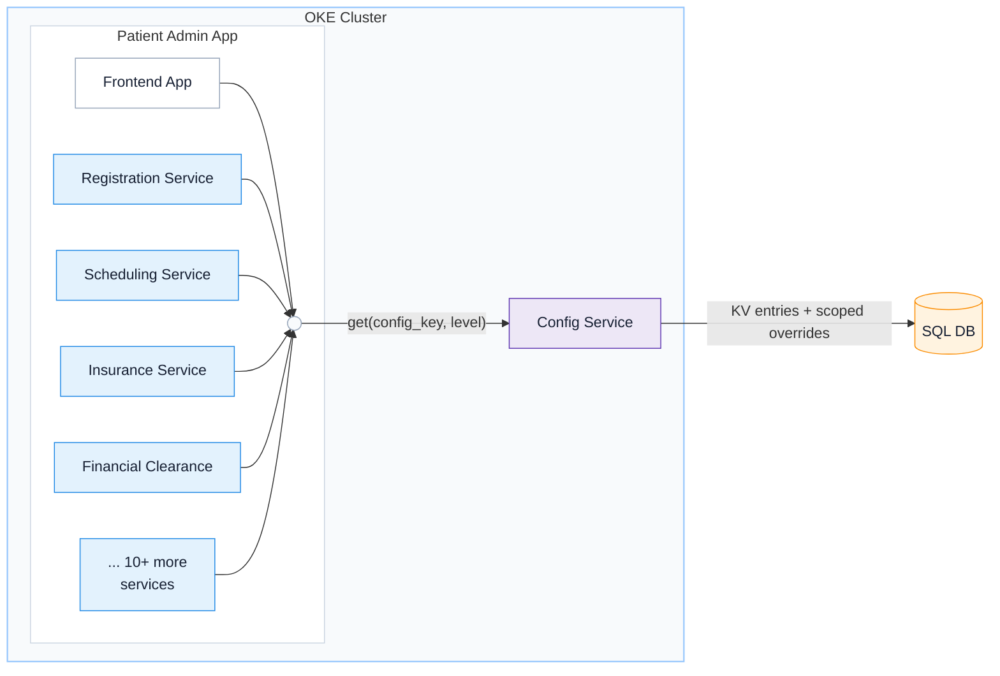
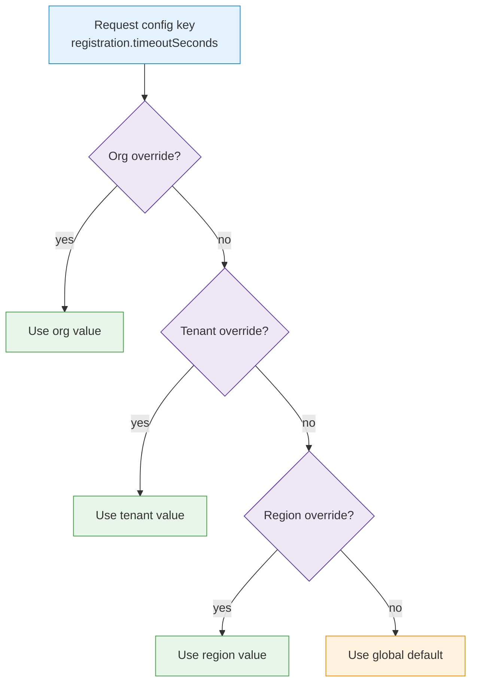
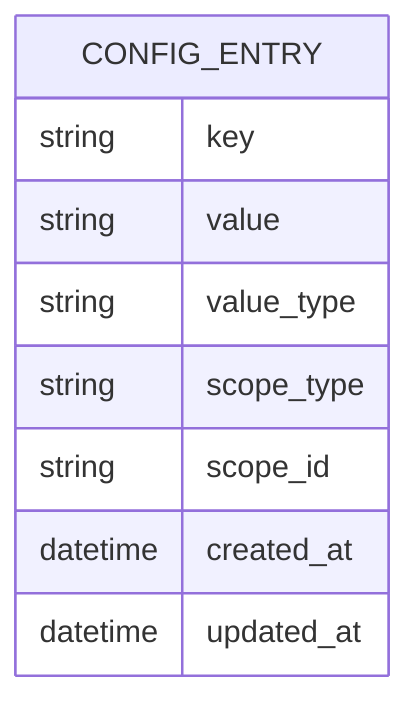
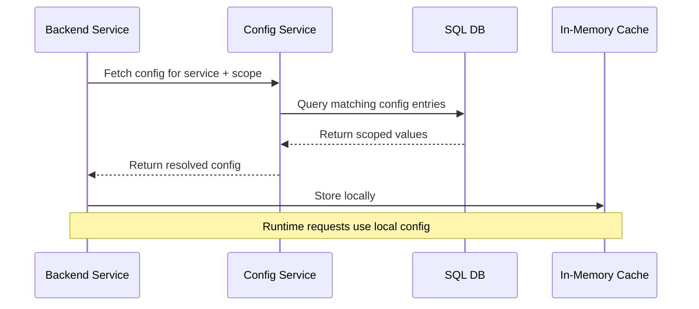

# Configuration Service

`Java / Micronaut` `SQL / Liquibase` `Oracle Kubernetes Engine`

The Config Service was a foundational service I owned for about a year, while working within Oracle Health & AI (OHAI).

In a nutshell, it was a simple `(key, value, scope)` store, housing the 'configurations' or 'settings' of all microservices in the cluster. Think feature flags, and other tunable parameters.
For instance, the key `example.registration.addressFormat` might have one value for US region tenants, and another for EU tenants. Or, United Healthcare might want all it's tenants to have `example.featureflags.flagX` enabled, while other orgs don't use that feature at all.

With many microservices, many environments, and the need to configure at the org/tenant/region level, the dimension space of our configs was exploding - we needed a better way to manage them than helm charts and environment variables.

We built this Configuration Service to migrate away from helm, for these key reasons:
1. Configs varied by region / country / tenant / org
- with helm, tiered settings creates a messy matrix: `service × environment × region × tenant × override`. our service collapsed that matrix (and the need to manage many helm charts) into a single source of truth, with ordered scopes and overrides

2. Helm tightly couples config changes to deployments
- we decoupled application version environment / tenant configuration

3. Helm values are not easily accessible at runtime, and not strongly typed
- with the new service, configs are accessible by a library call only when needed (no need to load env vars), and can be cached
- with many complex setting types, we could enforce type-safety at the service layer, rather than relying on individual services to do so

As the lead of the service, I
- worked daily to enhance/extend to the library methods and the API,
- planned, documented and executed the plan to migrate the first batch of caller microservices over to the Config Service... ensuring thorough testing and a successful first deployment rollout,
- served as first point of contact for questions around our API for config creation/update, scoping questions, and configuration bugs
- became a pro at coordinating/managing service availability and consistency.. as the service was critical to app startup and various pieces of runtime functionality.

## Cluster-wide startup dependency

Inside one OKE cluster, the frontend and 15+ services shared one config dependency and resolved keys through the same scoped lookup contract.

## Scoped overrides

Config resolves from most-specific to least-specific scope, with global defaults as the fallback.

## Flexible storage

A single config key can exist at multiple scopes. The resolver chooses the best match.

| key | scope | scope_id | value |
| --- | --- | --- | --- |
| `registration.timeoutSeconds` | GLOBAL | `*` | `30` |
| `registration.timeoutSeconds` | REGION | `us-west` | `45` |
| `registration.timeoutSeconds` | TENANT | `tenant-a` | `60` |
| `registration.timeoutSeconds` | ORG | `org-123` | `90` |

## Startup fetch

Services load configuration at startup and keep it in memory for predictable runtime behavior.

