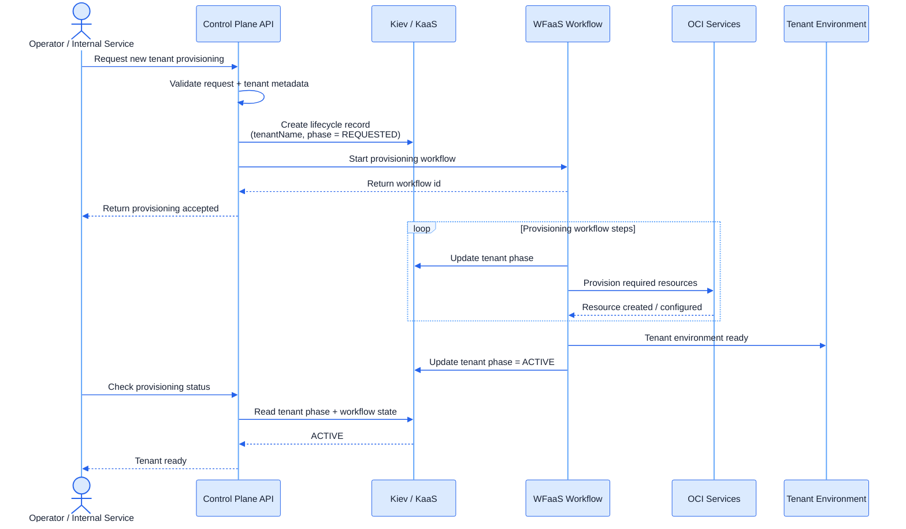

# Control Plane

An automated cloud tenant provisioning layer.

Java OCI Terraform

## What I built

A control plane that provisions and configures all cloud and app resources for a new tenant (environment) of a multi-tenant healthcare client.

-   orchestrated infrastructure provisioning using **Workflow as a Service (WFaaS)**
-   leveraged **Kiev<a href="#fn-kiev">1</a> as a Service (KaaS)** for resource lifecycle management
-   exposed APIs for triggering and monitoring provisioning workflows
-   acted as the bridge between application-level requests and cloud infrastructure

---

## Why it mattered

Previously, our infra team spent 15+ hours per week initializing cloud resources for new tenants..

-   updating terraform config files
-   deploying the new envs, and
-   verifying all cloud resources were created (VCNs, subnets, databases, IAM policies etc.)
-   ensuring everything was wired together correctly

We needed a system that could:

-   standardize environment creation
-   reduce human intervention
-   safely scale to many hospital deployments

The control plane allowed new tenants to be provisioned programmatically instead of manually. It turned provisioning into a **repeatable, automated workflow**.

---

## How it worked

[[diagram-float-right]]

Provisioning was modeled as a workflow-driven system spanning three layers:

-   **Control Plane API:** received tenant provisioning requests, validated metadata, and kicked off workflows
-   **WFaaS workflow:** orchestrated multi-step provisioning, including sequencing, retries, and failure handling
-   **OCI + KaaS:** OCI created the actual cloud resources, while KaaS tracked tenant lifecycle state across phases

[[flow-clear]]

---

<!-- ## My impact

-   contributed to design and implementation of the control plane service
-   integrated with WFaaS to define provisioning workflows
-   helped model infrastructure provisioning as structured, repeatable processes
-   worked through environment-specific challenges across tenants and regions -->
<!--
→ Result: enabled scalable, reliable onboarding of new hospital clients through automated infrastructure provisioning -->

Notes

<ol class="footnote-list">
  <li id="fn-kiev">
    Kiev is a NoSQL key-value store that supports mini-transactions for convenience. Here, it was used for resource lifecycle management. Once the workflow begins, a <code>{tenantName -> currentPhase}</code> entry can be stored in Kiev. As the workflow progresses, the tenant's phase is updated. This tracking supports workflow visibility and idempotency.
  </li>
</ol>

