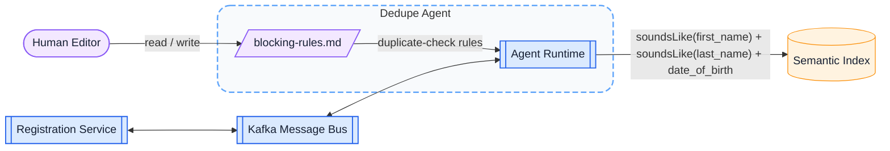

# Patient Dedupe Agent

A system for detecting potential duplicate patient records during registration.

Python Agentic Semantic Index

## What I built

A Python agent that identifies potential duplicate patients by querying the Semantic Index using matching rules written in plain-English markdown.

-   recieved info about a patient to be registered, uses its tools to compute the blocking key, and check it against Semantic Index (database)
-   ingested markdown-defined duplicate criteria (for example, combinations like first name + last name + date of birth)
-   deployed as an independent service and registered in an internal agent registry
-   callable by other agents/services (e.g. registration flow)
-   returned potential duplicate matches in real time

This allowed duplicate detection to be handled as a reusable, intelligent service.

---

## Why it mattered

Duplicate patient records pose major issues for healthcare systems:

-   fragmented medical histories
-   increased risk of medical errors
-   operational inefficiencies

We needed:

-   a scalable, automated way to detect duplicates
-   integration directly into the registration workflow
-   flexibility to change/improve matching logic over time

The Dedupe Agent solved this by providing intelligent duplicate detection whose matching logic could be defined in plain English in a markdown file, then interpreted by the agent at runtime.

---

## How it worked

1. duplicate-check rules were authored in markdown using plain-English criteria
2. while a user was actively entering patient registration information, the registration service invoked the Dedupe Agent by publishing to a Kafka bus
3. the agent, deployed as an independent service in the same cluster and registered in a central registry, interpreted those rules into Semantic Index queries
    - "similar first name, similar last name, same DOB" -> `soundsLike(first_name) + soundsLike(last_name) + date_of_birth`
    - "same first initial, same last name, same phone number, same zip code" -> `first_initial(first_name) + last_name + phone_number + zip_code`
4. those criteria were used as **blocking keys** to narrow candidate matches
5. the Semantic Index served as the data layer for patient records and supported the fuzzy matching needed to retrieve potential duplicates
6. candidate duplicates were returned and displayed to the administrator through a clean service interface

<!-- → Result: reduced risk of duplicate patient records and improved data integrity during registration -->
